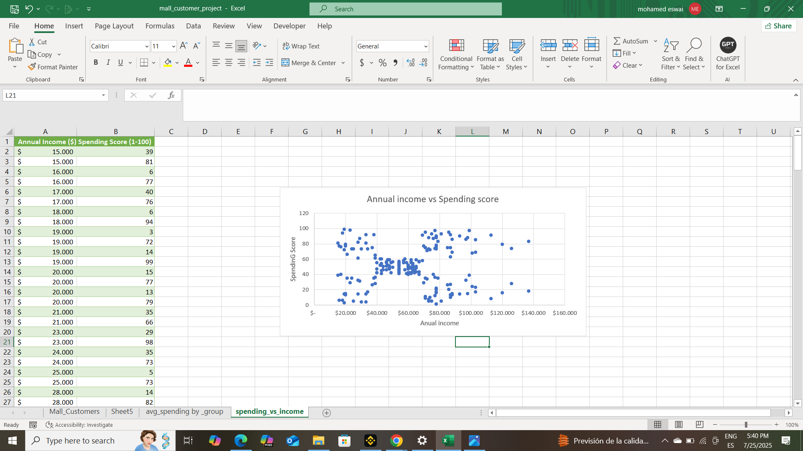
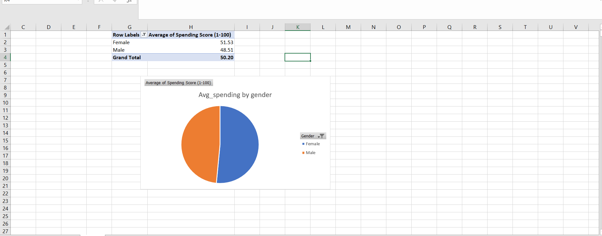
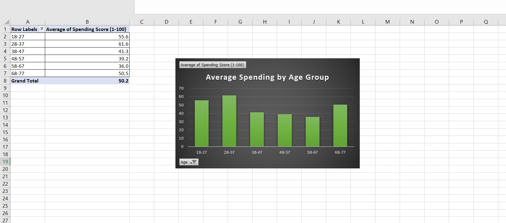

# customer_data-_analysis
# 🛍️ Customer Segmentation Analysis (Excel Project)

This is a personal data analysis project exploring customer behavior based on age, gender, and income using Excel.  
The goal is to identify patterns in spending scores to guide better marketing decisions.

---

## 📊 Dataset Overview

- 📁 Source: [Mall Customer Segmentation Data – Kaggle](https://www.kaggle.com/datasets/shwetabh123/mall-customers)
- 👥 Records: 200 customers
- 🧾 Features:
  - Gender
  - Age
  - Annual Income ($)
  - Spending Score (1–100)

---

## 🧠 Tools Used

- Microsoft Excel  
- Pivot Tables  
- Bar, Pie & Scatter Charts  
- Manual data cleaning & grouping

---

## 📈 Analysis & Insights

### 1. 💸 Income vs Spending Score

A scatter plot comparing annual income with spending score.

**Insight:**  
There is no strong correlation between income and spending score.  
Some low-income customers spend more than high-income customers, suggesting that income does not predict spending behavior.

---

### 2. 🧑‍🤝‍🧑 Average Spending by Gender

A comparison of average spending scores between male and female customers.

**Insight:**  
Female customers have a slightly higher average spending score** than males.  
This could reflect stronger engagement or loyalty.

---

### 3. 👥 Spending by Age Group

Customers were grouped into age ranges to observe spending trends.

**Insight:**  
Customers aged 28–37 have the highest average spending score.  
They may represent a key marketing target.

---

## 📁 Files Included

- `mall_customer_project.xlsx` – Full Excel workbook with charts and pivot tables  
- `.png` files – Visuals of charts  
- `README.md` – Project summary with insights

---

## 📫 Contact

**Mohamed Eswai**  
📍 Granada, Spain  
📧 m.eswai@icloud.com  
🔗 [LinkedIn](#) *(https://www.linkedin.com/in/mohamed-eswai-31207b372/)*

---

📌 *This project was built to demonstrate real-world data analysis skills using Excel. Ideal for marketing, retail, and customer segmentation tasks.*
